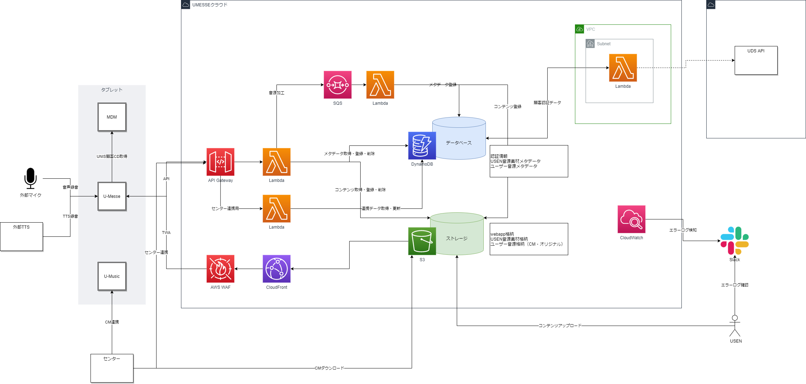
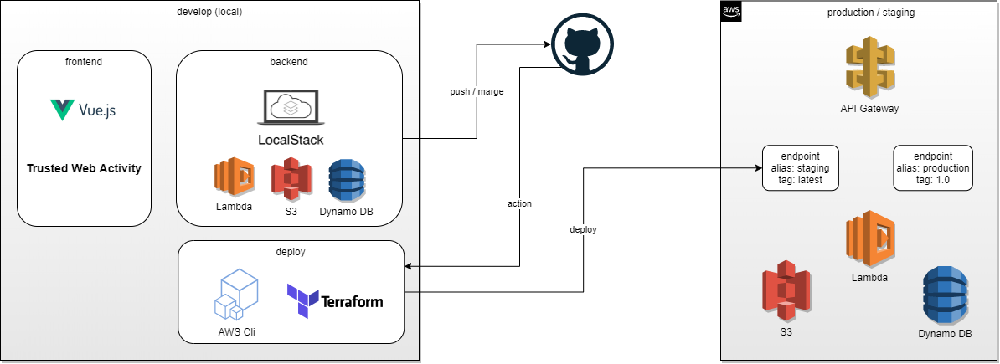

# 概要

AWS上にブラウザによるフロントエンド機能、APIによるバックエンド機能を構築し、アプリ側は[TWA](https://developers.google.com/web/android/trusted-web-activity)でブラウザを表示する  
機能は大きく分けて、CM作成、CM管理、オリジナル音声管理、CM発注機能がある  

##　環境

フロントエンド、バックエンドともにAWSサービスを利用する
AWSはU MESSE用のAWSアカウントを新規作成し、構築する
ユーザー情報はVPC経由でU MEMBERSのDynamoDBかU DS APIから取得する

## 構成図



## 機能概要

### 認証

- タブレットに搭載されているMDMからintentにてUNIS顧客CDを取得する
- AWSキーを用いてキー認証を行い、有効期限トークンを取得する
- 各APIへのアクセスはヘッダーにトークン＋ユーザーIDにてアクセスする

### CM作成

- ナレーション + チャイム + BGM (USENスタジオ音源)を選択しMIXさせる
- 構成は、開始チャイム（任意）＋ナレーション（必須・複数可能(MIN:1 MAX:4)・多言語を想定）＋終了チャイム（任意）となり、ナレーションにBGM（任意）をつける  
- 各素材は任意にボリューム調整可能
- USENが提供するナレーションだけでなく、自身で録音した音声(MAX:120秒)、TTSを利用した合成音声(MAX:120秒)も作成、選択することができる
- MIXにはffmpegを使用し、音圧・ラウンドネス調整・エンコードを実施する（簡易音源加工=OTORAKUと同等）

### CM管理

- 作成したCMを編集、再生、削除、共有、センターアップロード、拡張デバイス割り当て（フェーズ2.0予定）を行う
- センターアップロードはクラウド側からオンプレ側へのアクセスはインフラポリシーでNGのため、センター側からクラウドにアクセスし、作成したCMをダウンロードする
- 共有はグループIDによりグループ間でCMを利用できるようにする

### オリジナル音声管理

- オリジナルはユーザー自身で音声録音とTTS録音を行い、ナレーションとして利用する
- 新規作成、作成したオリジナル音声を再生、削除を行う
- 音声録音はタブレットのマイク（および外部マイク接続）を利用して録音する
- TTS録音はあらかじめコメントが記載されているテンプレートから選択し、一部入力（店名、開店時間など）をユーザーが行い、外部APIを利用する

### CM発注（TODO）

- 企業CMなどUSENへ依頼するCM発注を行う
- リンクで依頼フォームへ飛ばす方針で検討中

## 詳細

- [画面一覧](SCREEN_LIST.md)
- [機能一覧](FEATURE_LIST.md)
- [シーケンス一覧](SEQUENCE_LIST.md)
- APIはswaggerで管理予定

## 外部連携

### MDM

- intentによりUNIS顧客CD（unis_customer_cd）を取得する
- MDMで取得できるパラメータ

|Name|Type|
|----|----|
|contract_cd|String|
|**unis_customer_cd**|String|
|customer_name|String|
|customer_zip_cd|String|
|customer_state_name|String|
|customer_address1|String|
|customer_address2|String|
|customer_address3|String|
|umembers_key|String|
|uphon_contract_cd|String|
|uphone_number|String|
|uphone_number_key|String|
|ufax_number|String|
|ufax_number_key|String|
|com_ssid2_name|String|
|com_ssid2_pass|String|
|sereal_cd|String|
|create_date|String|
|renewal_date|String|

### TTS

- TODO: 先方調整中
- Hoya社のReadSpeakerを利用
- 無料版と有料版では品質、仕様が異なる模様
- [webapi](https://cloud.voicetext.jp/webapi)
- サンプル（無料版）

```bash
#!/bin/bash

url=https://api.voicetext.jp/v1/tts
key=esukobytdjetv1en

speakers="
hikari
takeru
"

text="
本日も、ご来店いただき、誠にありがとうございます。
お客様にお知らせいたします。
当店では、新型コロナウイルスの感染予防対策を推進しております。
ご来店の際は、出来る限りマスク着用の上、入店前には店頭備え付けのアルコール消毒液のご使用をお願いいたします。
ご不明な点がございましたら、お近くのスタッフまでお申し付けください。
"

for speaker in $speakers; do
  echo $speaker
  curl "$url" -o "$speaker.mp3" -u "$key:" -d "text=$text" -d "speaker=$speaker" -d "emotion=happiness" -d "emotion_level=1" -d "pitch=90" -d "speed=100"
  echo
  sleep 1
done

exit
```

### ユーザー情報

- TODO: 確認中
- U MEMBERSで利用しているDynamoDBもしくはU DS APIを利用し存在確認を行い、取得する

### センター・ES

- 作成したCMをアップロードする
- U MUSICのCMシーンに合わせてメタ情報を設定する必要がある
- クラウドからオンプレへのアクセスはインフラポリシーNGらしいので、センターからAPIを叩きデータをダウンロードしてもらう
- `\\fas\部門共有\8572_事業開発統括部　商品開発部　放送システム課(共有)\35_次世代ＰＪ\01.要件定義\PH1.5関連\U MESSE インタフェース項目サンプル【センター⇒U MESSEクラウド】.xlsx`

### 拡張デバイス（フェーズ2.0）

- フェーズ2.0対応予定

## 開発環境



- 開発はローカルでフロントエンドにvue（バージョン3.0以降、Typescript）、バックエンドにlocalstackを利用して行う
- githubのmasterマージでterraformを利用しAWS上にデプロイする（ステージング環境）
- lambdaはエイリアス・タグによるエンドポイントでステージング・本番環境へ振り分ける

## アプリの配布

- U-Musicと同様にU-IDMから配布する

## AWSのエラー検知

- TODO: U-Musicでどのようなエスかフローを構築するか確認中
- LambdaのログをCloudWatchへ飛ばし、CloudWatchからアラートログをSlackへ飛ばす方式を検討中(もしくはIM課へエスカレーション)

## 聴取ログ・利用動向レポート

- TODO: CP確認中
- オリジナルCMをローカル再生する場合などに聴取ログが必要か
- USEN提供の音源をどれくらい利用されているかレポートも必要か
- U-Musicの聴取ログ・レポートと合わせて確認中
