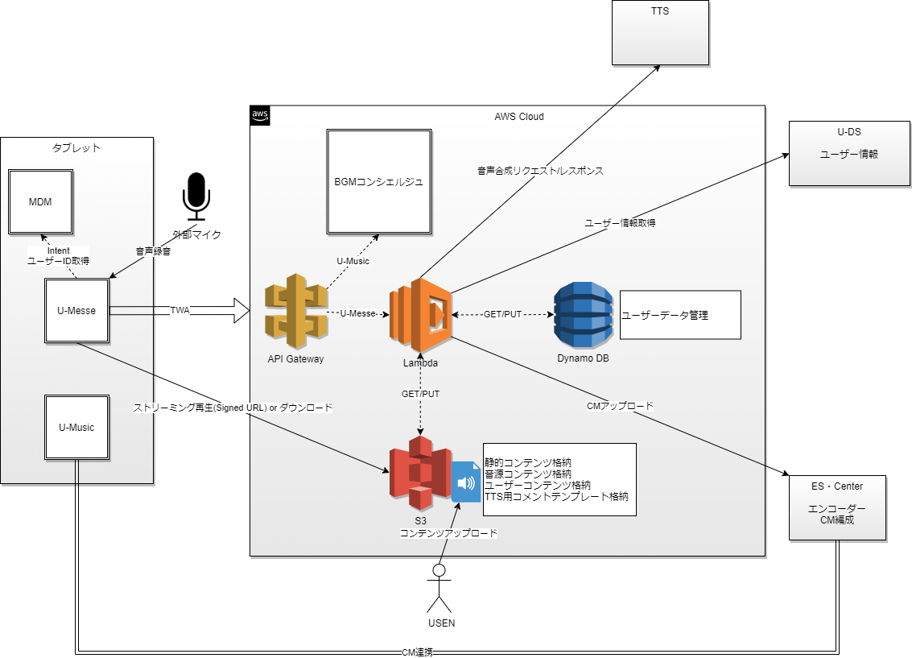

# 概要

AWS上にブラウザによる機能を搭載し、アプリ側はTWAで表示する  
機能は大きく分けて、CM作成、CM管理、CM発注機能がある  

## 構成図



## 機能概要

### CM作成

- ナレーション（コメント） + チャイム（ジングル） + BGM (無料の曲)を選択しMIXさせる
- 構成は、開始チャイム（任意）＋ナレーション（必須・複数可能：多言語を想定）＋終了チャイム（任意）となり、ナレーションにBGM（任意）をつける  
- 各素材は任意にボリューム調整可能
- USENが提供するナレーションだけでなく、自身で録音したデータ、TTSを利用したデータも作成、選択することができる
- MIX時に音圧、ラウンドネス調整を実施する（閾値はESからもらう想定）

### CM管理

- 作成したCMをタブレット上で再生するためダウンロード、U-Musicで再生するためセンターアップロード、外部デバイス（フェーズ2.0予定）へ転送する
- センターアップロードの形式は要検討

### CM発注

- 企業CMなどUSENへ依頼するCM発注を行う
- 依頼方法は要検討（フェーズ1.5ではメール送信？）

## 機能一覧

### アプリ

| 機能 | 説明 |
| ---- | ---- |
| ユーザーID取得 | MDMからintentでユーザーIDを取得する |
| キー認証 | キーを利用して認証を行い、トークンを取得する |
| トークン認証 | 発行されたトークンを利用して認証を行う |
| マイク録音 | デバイス（タブレット直か外部マイク）を利用して音声を録音し、クラウドへアップロードする |
| CM再生 | ダウンロードしたCMをローカル再生する |

### lambda

| 機能 | 説明 |
| ---- | ---- |
| キー認証 | キーを利用して認証を行い、トークンを発行する |
| トークン認証 | 有効期限トークンを発行し認証を行う |
| マイク録音 | ユーザーが作成した音声を管理する |
| TTS作成 | テンプレート一覧（ナレーションのひな型）から店名などのみテキスト編集し、TTSを利用して音声を作成、管理する |
| プロジェクト管理 | CM作成する上で、プロジェクト管理を行う　タイトルやカテゴリなどの属性情報が編集できる |
| CM作成・編集 | プロジェクト単位でナレーション、チャイム（開始/終了）、BGMを一覧から選択する　各素材の音量調整や視聴も可能 |
| CM MIX | ffmpegを利用して音源ファイルを結合する |
| CMセンターアップロード | 完成したCMをセンターアップロードし、U-Music上で利用する　センターから削除も可能（プロジェクトと紐づける？） |
| CM発注 | 企業CMの依頼を受け、データを送信する（TODO） |

### s3

- bucket: umesse-users (private) : ユーザーデータ

```
users/(user_id)/contents/(id).aac // 録音音源、TTS音源 
               /projects/(id).aac // CM音源
share/(group_id)/ // TODO
```

- bucket: umesse-contents (private) : 収録音源

```
narration/(カテゴリ)/*.aac // コナレーション音源
chime/(カテゴリ)/*.aac  // チャイム音源
bgm/(カテゴリ)/*.aac   // BGM音源
```

- bucket: umesse-webapp (private) : 静的コンテンツ

### dynamodb

- table: umesse-users : ユーザー管理テーブル

```
{
  user_id: {S: xxxxx},
  items: {
    status: {N: 有効/無効},
    timestamp: {N: timestamp},
    group_id: {S: xxxxx},
    auth: {
      token_id: {S: tokenid},
      expiration: {N: timestamp},
    },
    projects: [ // max 10?
      {
        project_id: {N: id},
        project_title: {S: title},
        status: {N: 有効/無効}
        start_chime: {
          id: {S: (chime_id or file_name)},
          volume: {N: int},
        },
        end_chime: {
          id: {S: (chime_id or file_name)},
          volume: {N: int},
        },
        bgm: {
          id: {S: (bgm_id or file_name)},
          volume: {N: int},
        },
        narrations: [
          {
            id: {S: (narration_id or file_name)},
            volume: {N: int},
          },
        ],
        mix: {S: (mix_id or file_name)},
        timestamp: {N: timestamp},
      },
    ],
    originals:[ // max 10?
      {
        id: {S: (original_id or file_name)},
        timestamp: {N: timestamp},
      },
    ],
  },
}
```
