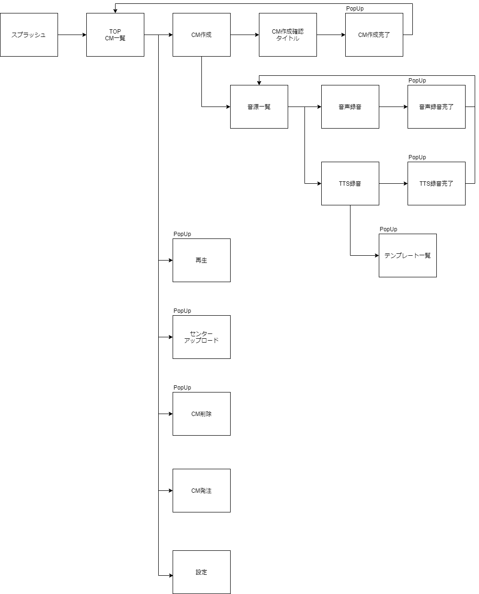

# 画面

## 画面遷移

## 画面一覧

| 画面 | 説明 |
| ---- | ---- |
| スプラッシュ | 起動時に表示する画面 表示中にIntentによるUNIS顧客CDの取得、認証、初期設定を行う |
| メインメニュー | TOP画面（メインメニュー） 大きく3つカテゴリーに分かれており、CMを作成するメニュー、CMを発注するメニュー、作成したCMを管理するメニューがあり、それぞれで各画面へ遷移する |
| 録音 | デバイスのマイク、もしくは外部入力によるマイクを利用して、音声を録音してナレーション素材を作成する 作成後は素材選択画面へ遷移する |
| TTSテンプレート一覧 | 一覧からTTSで利用する原稿一覧を選択する 原稿は「店舗名」「開店時間」などは自由に変更できるようになっている |
| TTS必要部分入力 | 原稿の変更できる箇所を自由に入力することができる |
| ナレーション素材一覧 | USEN提供のナレーション素材を一覧から選択する |
| CM発注 | 専用の入力フォームへ遷移する（TODO） |
| CM一覧 | 作成したCMを一覧で表示する 再生、編集、削除が行える |
