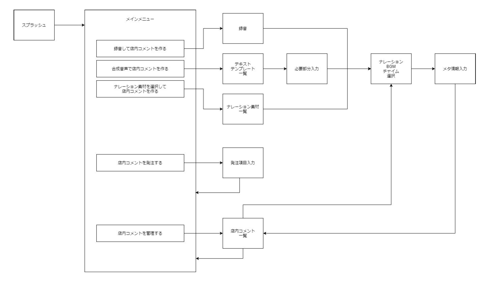

# draft

## 画面一覧

| 画面 | 説明 |
| ---- | ---- |
| スプラッシュ | 起動時に表示する画面 表示中にIntentによるユーザーID取得や認証、初期設定を行う |
| TOP | TOP画面 作成したCMを一覧で表示する、存在しない場合は空 各CMに編集、削除、再生、センターアップロードを行うメニューがある ＋マークからCM新規作成を行える カテゴリによる絞り込み機能あり |
| CM作成 | CMを作成する画面 開始/終了チャイム(任意)・ナレーション(必須)・BGM(任意)を選択する 視聴ボタンをタップするとMIX処理を行い、視聴することができる  |
| CM作成確認 | 作成したCMのタイトル・カテゴリを選択する  |
| 音源一覧 | チャイム・ナレーション・BGM・オリジナル一覧を表示する オリジナルはここで新規作成/削除可能？ |
| 音声録音 | 音声録音を利用してオリジナルのナレーションを作成する マイクは外部デバイスを想定 |
| TTS録音 | 外部TTSを利用してオリジナルのナレーションを作成する 利用するテンプレートを選択する |
| テンプレート一覧 | TTSで利用するテンプレート一覧を表示する |
| CM再生 | 作成したCMをローカルで再生する |
| センターアップロード | 作成したCMをセンターへアップロードする CMメタの設定を行う |
| CM削除 | 作成したCMを削除する センターアップロード済みの場合、削除できないようにする？ |
| CM発注 | USENに企業オリジナルCMの制作依頼を投げる |
| 設定 | TODO |

## 画面遷移

