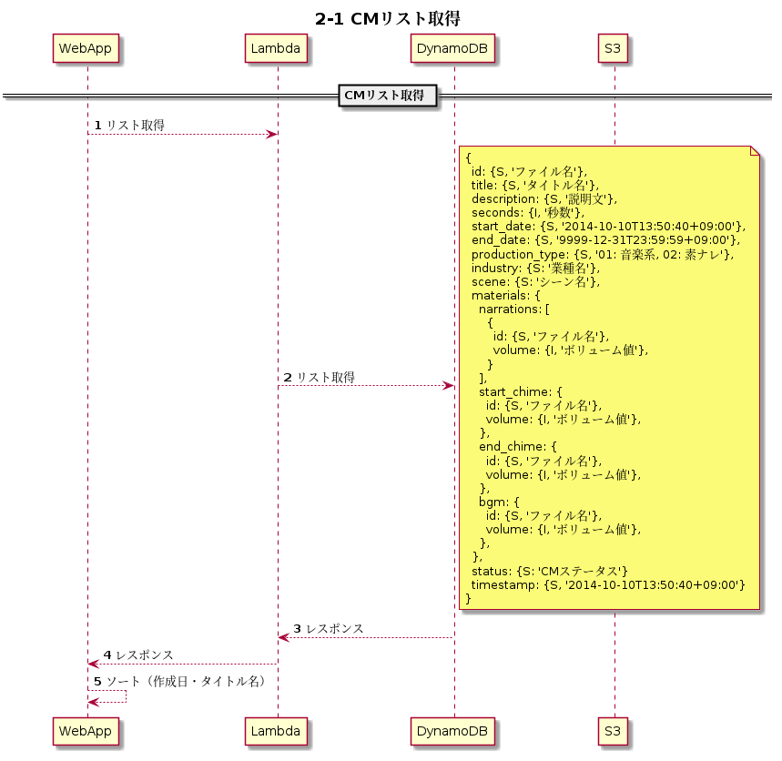
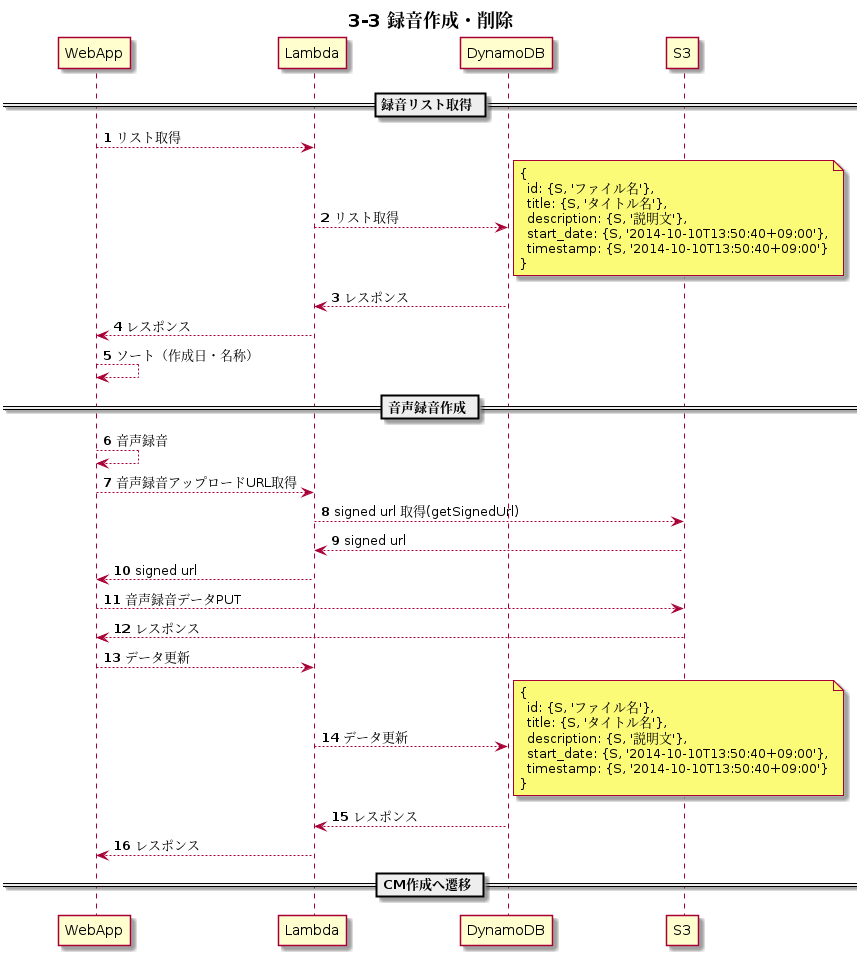

# draft

## 認証

### 1-1 認証（TODO）

## CM管理

### 2-1 CMリスト取得

### 2-2 CM再生

### ~~2-3 CM共有・解除~~ ※フェーズ2.0へリスケ

 

### 2-4 CMセンター追加・変更・解除

- 前提条件：追加の場合のみCMファイルを連携、変更はメタデータのみ、削除は終了日時連携

### 2-5 CMセンター連携

## 作成・更新・削除

### 3-1 CM作成

### 3-2 CM変更・削除

### 3-3 録音作成・削除

### 3-4 TTS作成・削除

## CM発注

### 4-1 CM発注 (TODO)
